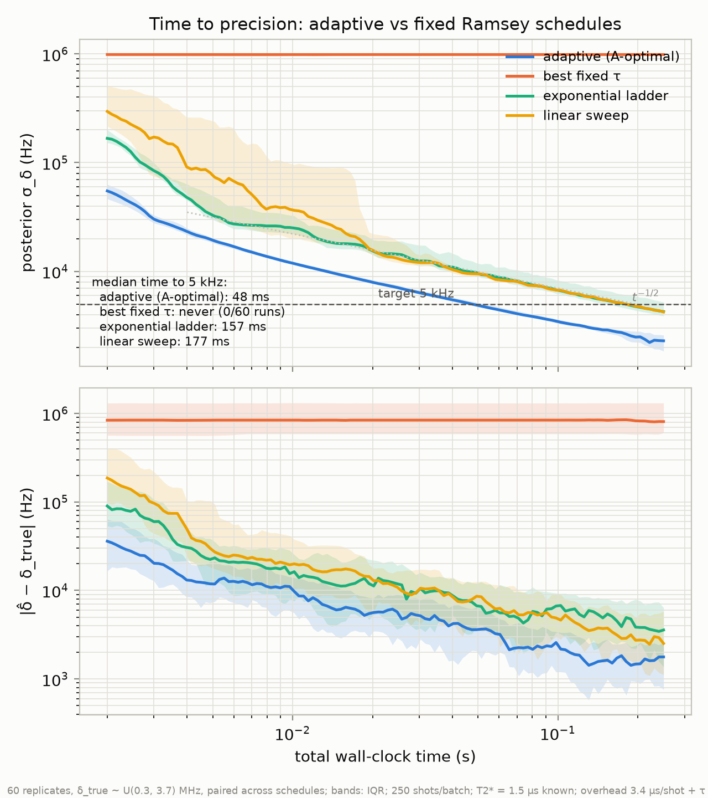
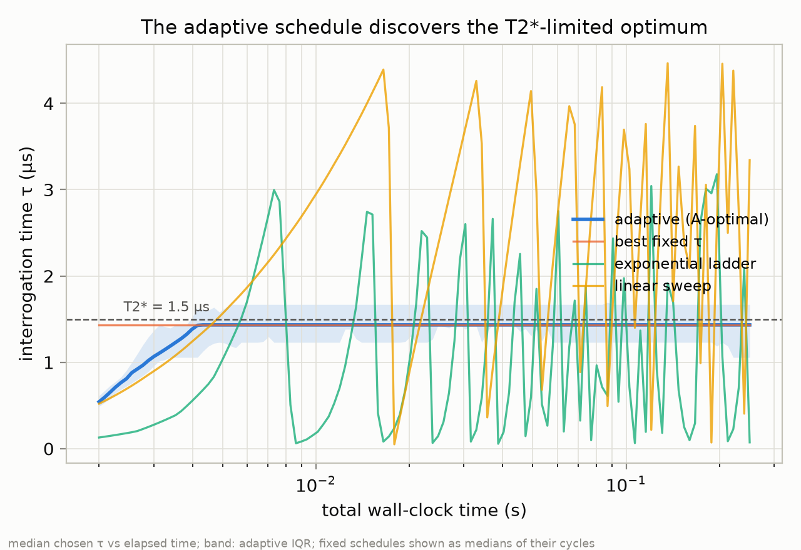

# Phase 3 — Adaptive Ramsey: what choosing τ on the fly buys you

**Result:** a Bayesian adaptive schedule that re-picks the Ramsey
interrogation time after every batch reaches a 5 kHz posterior uncertainty
in a median of **48 ms** of wall-clock sensing time, against **157 ms** for
the best fixed schedule that converges at all — a **3.25× speedup**. The
textbook "best single τ" baseline never converges: over a 3.4 MHz prior it
is not even identifiable. All numbers below come from 60 paired replicates
per schedule (config `experiments/phase3/adaptive_vs_fixed.json`, seed 401,
git SHA `124b87b`).

## The question

Phase 2 ended with a negative-shaped result: with a well-specified
likelihood, better *estimators* (Bayesian, NN) recover essentially nothing
over least squares — both sit at 0.94–1.09× the Cramér–Rao bound. The
sensitivity left on the table is not in the estimator; it is in the
*experiment design*. A Ramsey measurement at interrogation time τ is most
informative when τ ≈ T2*, but only if you already know the detuning well
enough that the fringe at that τ is unambiguous. Fixed schedules must
compromise once and live with it. An adaptive protocol can spend its first
milliseconds buying coarse, unambiguous information and the rest buying
precision. Phase 3 measures what that is worth in wall-clock time.

## Protocol

Everything runs on the Phase 1 measurement model: Poisson photon counts
with R = 60 Mcps, contrast C = 0.25, t_read = 0.4 µs, f_pump = 0.95;
Ramsey fringe P₀ = ½(1 + cos(2πδτ)·e^(−τ/T2*)) with T2* = 1.5 µs treated
as known. The unknown is the detuning δ, drawn uniformly from
0.3–3.7 MHz. Batches of 250 shots; each shot costs its honest wall-clock
price t_init + τ + t_read + t_dead = 3.4 µs + τ. The budget is 0.25 s of
*sensing* time (decision compute is not charged — see limitations).

**Posterior.** A 600-point grid over δ with exact Poisson batch
likelihood, updated after every batch (`src/nvsim/estimators/adaptive.py`).
This is the sequential 1D sibling of the Phase 2 grid posterior.

**Decision rule.** Before each batch, choose the τ (from a 60-point
log-grid, 0.05–4.5 µs) that minimizes the *expected posterior variance*
(A-optimality): for each candidate τ, marginalize the predicted outcome
over the current posterior using a 32-node Gauss–Hermite quadrature on
k ~ N(nλ, nλ), update a copy of the posterior for each representative
outcome, and average the resulting variances. The lookahead runs on a
coarsened copy (200 grid points, 24 τ candidates); the real update always
uses the full grid and exact Poisson likelihood.

**Baselines**, all paired on identical true-δ draws:

- **best fixed τ** — the single τ maximizing prior-averaged Fisher
  information (1.43 µs, essentially the T2*/2-ish textbook optimum);
- **linear sweep** — 12 points cycling linearly over 0.05–4.5 µs, the
  standard "fit the whole fringe" schedule;
- **exponential ladder** — τ doubling from 0.05 µs, the standard
  phase-estimation heuristic.

## Results



Median time to σ_δ < 5 kHz (≈ 178 nT along the NV axis at
γ_e/2π = 28.02 GHz/T):

| schedule | median time to 5 kHz | runs reaching target |
|---|---|---|
| adaptive (A-optimal) | **48 ms** | 60/60 |
| exponential ladder | 157 ms | 43/60 |
| linear sweep | 177 ms | 55/60 |
| best fixed τ | never | 0/60 |

At any snapshot the gap is similar: at 10 ms the adaptive posterior is at
11.9 kHz against 25.0 kHz (ladder) and 36.7 kHz (sweep). By the end of the
0.25 s budget the adaptive run sits at 2.2 kHz — about 80 nT — with a
median true error of 1.8 kHz, i.e. the posterior width is an honest error
bar (bottom panel of the figure). The convergent schedules all track the
t^(−1/2) reference slope once past their transients; adaptivity shifts the
curve down rather than changing the exponent, which is exactly what it
should do — the speedup is a constant factor in time, here 3.25×.

**Why the "best" fixed τ fails completely.** At τ = 1.43 µs the fringe
period in δ is 1/τ = 0.70 MHz, so the 3.4 MHz prior wraps ~4.9 fringes.
Every measurement at a single τ is consistent with the same set of ~10
aliased detunings (cos symmetry doubles them), and the posterior converges
to a comb of narrow modes it can never prune — median final σ = 987 kHz,
worse than the prior width would suggest precision-wise and never
improving. Fisher information is a *local* quantity; maximizing it says
nothing about global identifiability. Any real single-τ protocol relies on
prior knowledge much tighter than 1/τ; over a wide prior it is not a
sensing protocol at all.

**What the adaptive rule actually learned.**



The A-optimal rule was given no schedule structure — just "minimize
expected posterior variance one batch ahead" — and it reproduces the
phase-estimation playbook on its own. The median first choice is
τ = 0.12 µs, short enough that one fringe period (8.3 MHz) covers the
entire prior: maximally coarse but unambiguous. As the posterior narrows,
the chosen τ climbs and saturates at 1.43 µs, the same T2*-limited optimum
the fixed baseline uses — but by the time the adaptive run parks there, its
posterior is already narrow enough (≪ 0.70 MHz) that the aliases carry no
mass. The exponential ladder hard-codes a crude version of this ramp,
which is why it is the best fixed baseline; the adaptive rule beats it by
ramping at the rate the data justifies rather than a fixed doubling, and by
never wasting batches at τ values the posterior has outgrown.

A run is ~208 batches (median; range 178–237 — adaptive runs that settle
on longer τ fit fewer batches into the fixed budget).

## Limitations

- **T2* is known and fixed.** The posterior is 1D in δ. Joint (δ, T2*)
  adaptivity is a harder decision problem and untested here.
- **No drift.** Phase 2 showed drift is where Bayesian methods earn their
  keep; combining the two (adaptive τ under 1/f drift, discount/forgetting
  in the posterior) is the obvious next experiment.
- **Decision compute is free in the accounting.** Each A-optimal decision
  costs ~0.1–0.2 s of CPU here — ~100× the 1 ms sensing batch it steers.
  On hardware this would need a lookup table, a cheaper utility, or an
  amortized policy (see RL note below). The wall-clock axis charges
  sensing time only; this flatters adaptive relative to a real-time
  implementation and is the main caveat on the 3.25×.
- **Batch granularity.** 250 shots between decisions; finer batching would
  help the adaptive schedule further (more decision points) at more
  compute.
- **Coarsened lookahead.** The utility is evaluated on a 200-point grid
  and 24 τ candidates. Spot checks against the full grid showed the same
  argmin; not exhaustively verified.

## The RL gate

The Phase 3 plan gated an RL/policy extension on the Bayesian adaptive
scheme showing ≥2× wall-clock speedup. Measured: **3.25×**, and the
decision-compute limitation above is precisely the problem an amortized
policy solves (train offline against the simulator, deploy a
microsecond-latency network that maps posterior summaries → τ). Recommended
as future work; not implemented in this phase.

## Reproducing

```bash
source .venv/bin/activate
python scripts/run_phase3.py experiments/phase3/adaptive_vs_fixed.json   # ~2.5 h CPU
python scripts/plot_phase3.py                                            # figures + speedup
pytest tests/test_adaptive.py tests/test_run_phase3.py
```

Artifacts (JSON, one per schedule, with config + seed + git SHA embedded)
are committed under `experiments/phase3/artifacts/`.
