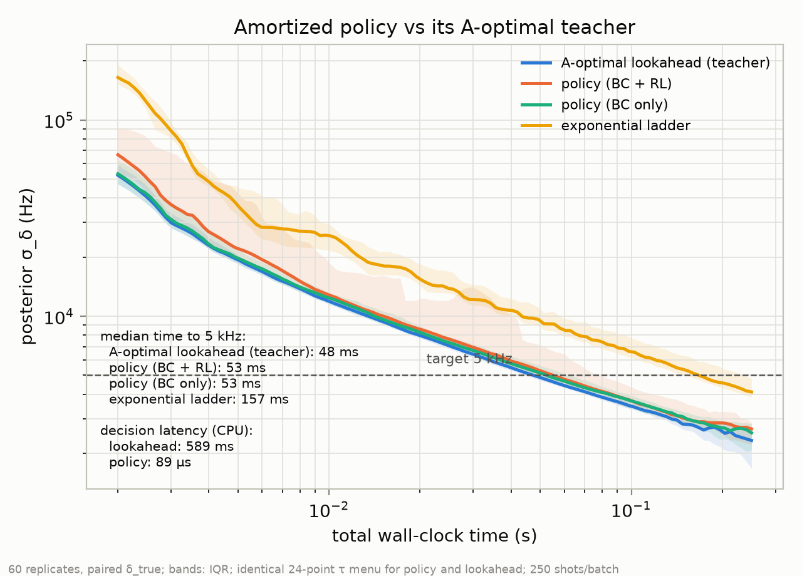
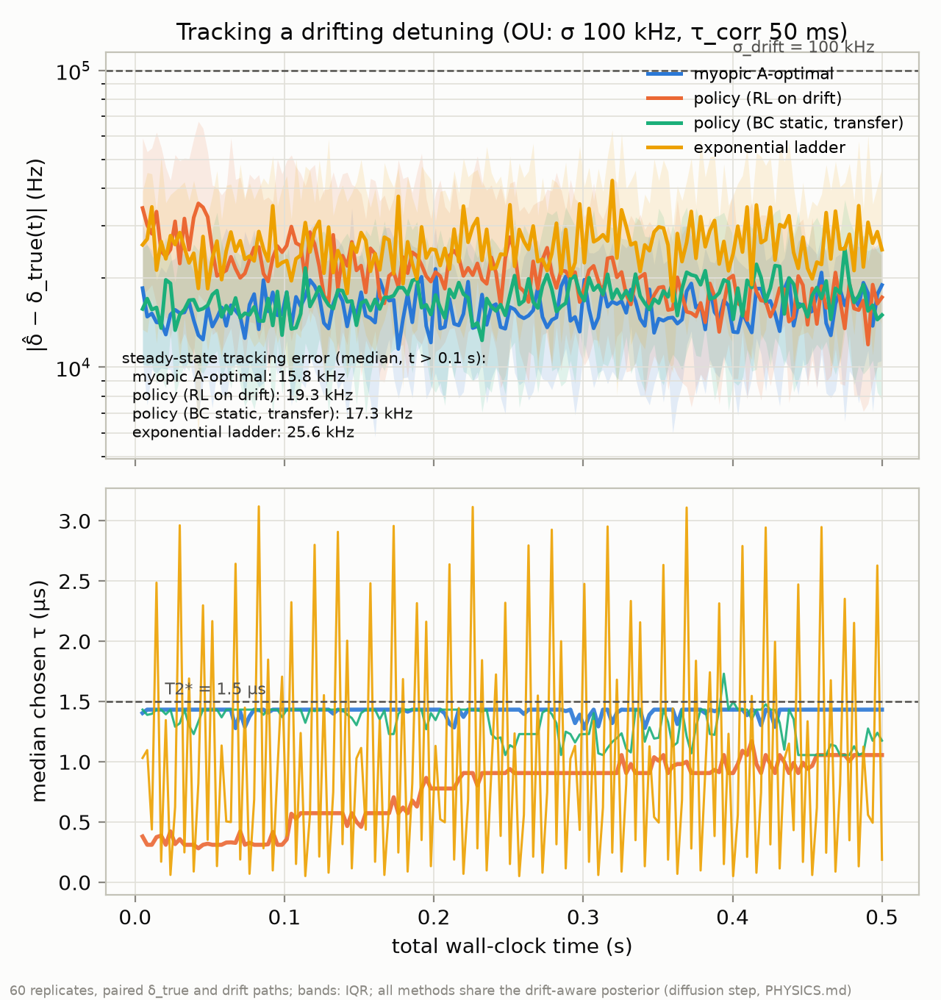

# Phase 3b — Amortizing the adaptive schedule: what a neural policy buys, and what RL doesn't

**Result:** a ~20k-parameter MLP trained by behavior cloning reproduces the
Phase 3 A-optimal adaptive Ramsey schedule at **1.09×** its time-to-target
(52.8 vs 48.3 ms median to a 5 kHz posterior, 59/60 runs converging) while
deciding in **89 µs** instead of **589 ms** — a 6,600× latency reduction
that moves the adaptive protocol from "offline analysis" to "faster than
one 250-shot measurement batch." Two honest negatives came with it: PPO
fine-tuning never improved on cloning (and under a subtly unstable
objective actively broke it), and under detuning drift a nonmyopically
trained policy tracked **22% worse** than the myopic lookahead it was
supposed to beat. Configs/seeds: `experiments/phase3b/*.json` (seeds
411–413, 402–403); artifacts embed exact git SHAs.

## Why amortize

Phase 3 established that choosing each interrogation time from the current
posterior is worth 3.25× in wall-clock sensing time. But the decision rule
that achieves it — Gauss–Hermite expected-posterior-variance over 30 τ
candidates — costs ~0.6 s of CPU per decision, steering a batch that takes
~1 ms to measure. That 600:1 compute-to-sensing mismatch makes the scheme
unusable in real time. The standard cure is amortization: train a network
offline against the simulator, deploy a constant-time lookup. The
question worth an experiment is not "can a net fit the rule" (it can) but
*where the imitation breaks and whether reinforcement learning can go
beyond the teacher* — nonmyopically, where a one-batch lookahead is
provably shortsighted.

## Setup

Policy: MLP (38 → 128 → 128 → 30 logits + a value head for RL), acting on
a feature summary of the sequential posterior: log σ, normalized mean,
entropy, budget fraction elapsed, top-two-mode mass ratio and separation
(the fringe-aliasing signal), and a 32-bin max-pooled posterior. The
action menu is *exactly* the 30-candidate log-τ grid the coarsened
A-optimal search uses, so any performance gap is the rule, not the menu.
Environment: a vectorized re-implementation of the Phase 3 sequential loop
(E parallel episodes as (E, 600) grids, exact-Poisson updates) — proven
bitwise-equivalent to the production posterior by unit test.

Training was two-stage. **Behavior cloning:** 200 teacher episodes
(41,293 A-optimal decisions, 2.65 h of teacher compute — data generation,
not network training, is the entire cost), cross-entropy, held-out
exact-action accuracy 0.67 (0.87 within ±2 adjacent τ candidates).
**RL fine-tune:** in-repo PPO-style clipped surrogate (~100 lines, no RL
library; 256 parallel envs × 300 iterations ≈ 25 min CPU), reward = per-
batch reduction in log posterior variance, which telescopes to exactly the
episode objective.

## Static result: cloning matches the teacher; RL adds nothing



| method | median time to 5 kHz | converged | decision latency |
|---|---|---|---|
| A-optimal lookahead (teacher) | 48.3 ms | 60/60 | 589 ms |
| policy, BC only | 52.8 ms | 59/60 | 89 µs |
| policy, BC + RL (fixed objective) | 52.8 ms | 50/60 | 89 µs |
| exponential ladder | 156.6 ms | 48/60 | — |

The cloned policy is a faithful 1.09× copy of the teacher — it opens at
τ = 0.12 µs and rides the same ramp to the T2*-limited plateau. The
latency table is the deliverable: at 89 µs per decision the policy decides
faster than the ~1 ms batch it steers, so a real-time implementation is
compute-trivial (and 89 µs is PyTorch-on-CPU with no effort spent; the
net is small enough for FPGA if it ever mattered).

**RL fine-tuning was a net negative, measured twice.** The first run
(raw-return objective) raised mean return by 0.2% while dropping
convergence to 40/60: it had shifted the opening probe from 0.12 µs to
0.42 µs, whose 2.4 MHz fringe period is narrower than the 3.4 MHz prior —
the failed runs sat exactly on wrong-alias detunings, 0.7–1.2 MHz off. The
mean-return objective happily trades a rare catastrophic tail for a
slightly faster average, which is precisely the wrong trade for a sensor.
One designed retrain under a stabilized objective (normalized returns,
log-ratio clamp, Huber value loss) restored the short opening and 50/60
convergence at an unchanged 52.8 ms median — still strictly worse than
cloning. On-distribution, with a near-optimal teacher, there was nothing
for RL to find; exploration only risked the insurance the teacher had
already priced in.

## Drift result: myopia was never the bottleneck

The one setting where a lookahead-one-batch rule is structurally
shortsighted is a drifting truth: refining the current estimate competes
with keeping reacquisition headroom. We put an Ornstein–Uhlenbeck drift on
the detuning (σ = 100 kHz, τ_corr = 50 ms — drift comparable to the target
precision within a correlation time), gave *every* method the same
drift-aware posterior (a diffusion prediction step each batch, PHYSICS.md),
and fine-tuned a policy directly on drifted episodes from the BC init.
Metric: median tracking error over the final 80% of 0.5 s runs, 60 paired
drift paths.



| method | steady-state tracking error |
|---|---|
| myopic A-optimal lookahead | **15.8 kHz** |
| policy, BC static (transfer) | 17.3 kHz |
| policy, RL on drift | 19.3 kHz |
| exponential ladder | 25.6 kHz |

The nonmyopia hypothesis fails cleanly. The drift-trained policy *did*
learn a qualitatively different strategy — the τ-trajectory panel shows it
holding 0.4–1.0 µs, well short of the 1.43 µs the myopic rule uses,
i.e. it bought reacquisition headroom — and that strategy tracks 22%
worse. The mechanism, visible in the figure: with the diffusion step in
the posterior, the myopic rule already responds to drift optimally at
this timescale — the posterior widens, the A-optimal τ shortens by itself
for a batch or two (the small dips in the blue trace), then returns to the
T2* plateau. There is no lock-loss regime to insure against at
σ_drift ≪ the fringe ambiguity scale, so paying steady-state precision
for headroom is pure loss. Even zero-shot transfer of the static policy
(17.3 kHz) beats the drift-specialized one.

## What Phase 3b established

1. **The Phase 3 speedup is deployable.** The 3.25× adaptive win does not
   depend on a 0.6 s/decision lookahead: a cloned 20k-parameter net
   delivers 1.09× the teacher at 89 µs/decision. Amortization is cheap,
   works, and its cost is teacher-data generation only.
2. **Distillation, not reinforcement.** With a near-optimal teacher and a
   well-specified simulator, PPO fine-tuning had no upside on-distribution
   and real downside in the tails. If the goal is matching the teacher,
   clone it.
3. **Myopic + drift-aware posterior is hard to beat.** At drift rates that
   don't threaten fringe-lock, the one-batch lookahead with a diffusion
   prediction step is already the right policy; nonmyopia has no room to
   pay. The regime where it might (σ_drift·τ_batch approaching the fringe
   ambiguity, or abrupt jumps rather than diffusion) is characterized but
   untested.

## Limitations

- Fixed batch size (250 shots) and known drift parameters (σ, τ_corr) —
  the diffusion step and the truth process share them by construction.
- Known T2*, as in Phase 3.
- The RL negative is for this PPO variant at this budget from a BC init;
  it bounds "easy wins," not the method. A distribution-robust objective
  (CVaR, worst-case-over-δ) is the natural follow-up if the tail behavior
  matters — but that is a new experiment, not a tuning pass.
- Latency measured as PyTorch CPU inference; a hardware deployment path
  (quantization, FPGA) is out of scope.
- Jump/telegraph drift and unknown-drift-parameter tracking untested.

## Reproducing

```bash
source .venv/bin/activate
python scripts/train_policy.py experiments/phase3b/bc.json --stage bc      # ~2.7 h (teacher data)
python scripts/train_policy.py experiments/phase3b/rl.json --stage rl      # ~25 min
python scripts/train_policy.py experiments/phase3b/rl_drift.json --stage rl
python scripts/run_phase3b.py experiments/phase3b/policy_vs_aoptimal.json  # static eval
python scripts/run_phase3b.py experiments/phase3b/policy_vs_aoptimal.json --latency
python scripts/run_phase3b.py experiments/phase3b/drift_eval.json \
    --out-dir experiments/phase3b/artifacts_drift                          # drift eval
python scripts/plot_phase3b.py                                             # figures + gates
```

Checkpoints (.pt) and the BC dataset (.npz) are gitignored and regenerate
deterministically; evaluation artifacts (JSON, with config + seed + SHA)
are committed under `experiments/phase3b/artifacts*/`.
